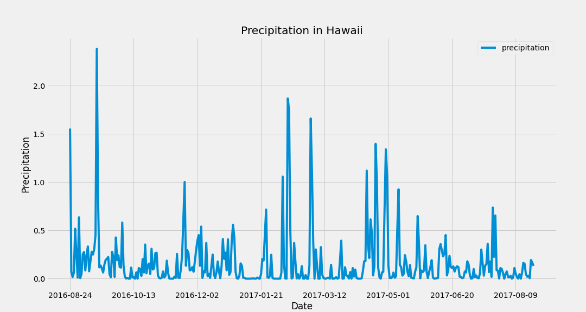

# sqlalchemy_challenge

# Aloha! Surf's up, brah!

*Image taken by Heather Mott*

## Climate Analysis and Exploration

Prior to planning my trip to boogie, SUP, and rip in Hawaii, I utilized Python and SQLAlchemy to do some gnarly climate analysis and data exploration using SQLAlchemy ORM queries, Pandas, and Matplotlib.

### Precipitation Analysis

Using the data, I grabbed 12 months of precipitation data and loaded it into a wicked dataframe to plot.

*Figure 1: Plot of Precipitation*

### Station Analysis

Without wiping out, I checked out which station in Hawaii was the most active.  I made another rad dataframe and histogram showing the temperature observed over 12 months at this rockin' station.

*Figure 2: Histogram of Temperature at Most Active Station*

## Climate App

**tbd - under construction**

Mahalo, Heather

