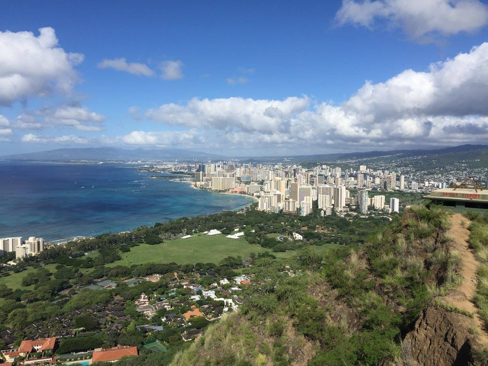
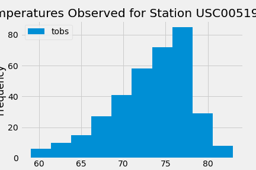
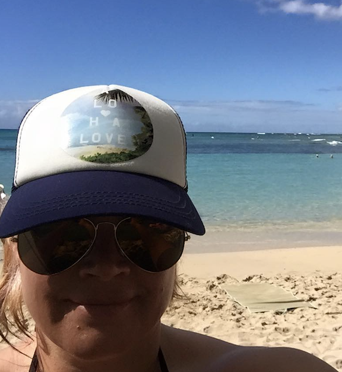

# sqlalchemy_challenge

# Aloha! 
# Some great pipe - surf's up, brah!

*Image taken by Heather Mott*

## Climate Analysis and Exploration

Prior to planning my trip to boogie, SUP, and rip in Hawaii for a while, I utilized Python and SQLAlchemy to do some gnarly climate analysis and data exploration using SQLAlchemy ORM queries, Pandas, and Matplotlib.

### Precipitation Analysis

Using the data, I grabbed 12 months of precipitation data and loaded it into a wicked dataframe to plot.

*Figure 1: Plot of Precipitation*

### Station Analysis

Without wiping out, I checked out which station in Hawaii was the most active.  I made another rad dataframe and histogram showing the temperature observed over 12 months at this rockin' station.

*Figure 2: Histogram of Temperature at Most Active Station*

File: [climate_starter.ipynb](https://github.com/HeathMo/sqlalchemy_challenge/blob/main/climate_starter.ipynb)

## Climate App

Switching over to goofy-foot, I designed a Flask API based on the queries developed.

*Figure 3: Snapshot of the front portion of the API*

File: [app.py](https://github.com/HeathMo/sqlalchemy_challenge/blob/main/app.py)

## Bonus 1 & 2

After munching on some Loco Moco and Shave Ice, I recharged and paddled through a little chop into the Bonus portions.  I completed Bonus 1 and the majority of Bonus 2 for some extra points in the surf competition.  But then dinged a skeg and had to paddle back in to call it a day rather than be a buoy.

File: [Bonus 1 COMPLETE](https://github.com/HeathMo/sqlalchemy_challenge/blob/main/temp_analysis_bonus_1_starter.ipynb) 
File: [Bonus 2 PARTIAL COMPLETION](https://github.com/HeathMo/sqlalchemy_challenge/blob/main/temp_analysis_bonus_2_starter.ipynb)

Mahalo, Heather

 
*The Shaka - familar greeting in Hawaii that means any friendly message along the lines of "Right on", "Thank you", "Life is good", etc.* 
*Source: The Internets and experience on the islands*

 
*Selfie taken on Waikiki*

